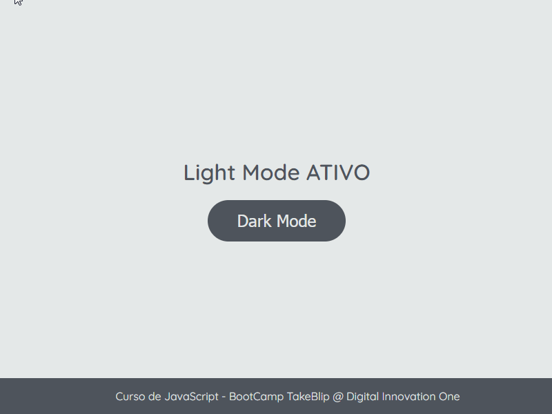

# Trocando o tema da página

Esta é uma adaptação da atividade feito em CSS e JavaScript que permite trocar pra 3 tipos de temas na página HTML: Light Mode, Dark Mode e Vim Dark Blue, veja a demonstração abaixo:

